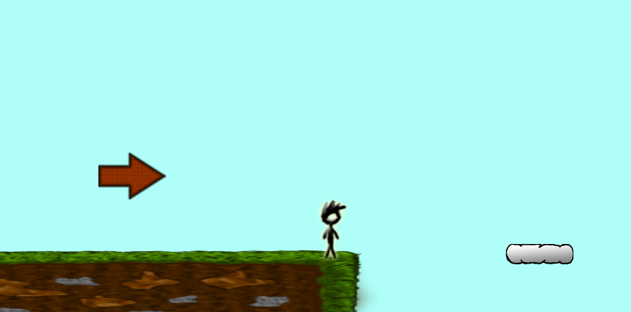
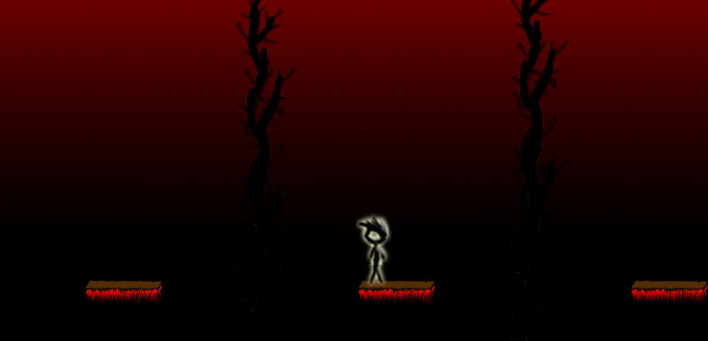

# SkyJump

This game was created in 24 hours for a GameJam event hosted by Vilniaus University.

## Launching the game
To launch the game simply go to the game folder and launch the SkyJump.jar file.
For development, use Grails version 1.11

## Theme

Theme is Deviation. Action despite the system.

## Comments

When you start the game the arrow tells you to go to the right to play the game.
However you can try and go in the other direction and try to win the game
despite what the game instructions were.

## About

Game author is Ernestas Mitkus. The game was created in 2015-04-18.
All graphics are made by me. Music and sounds used are copyright-free.

## Images

